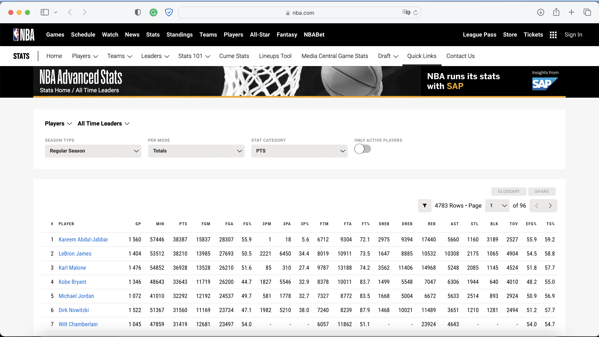

**About me**

- ***Hassan OUKHOUYA***
- ***E-mail***: hassan.oukhouya@um5r.ac.ma
- ***LinkedIn***: https://www.linkedin.com/in/hassan-oukhouya-3901b816b/
- ***ORCID iD***:  https://orcid.org/0000-0002-5058-2008
- ***Upwork***: https://www.upwork.com/services/product/time-series-analysis-with-python-or-r-studio-1449669530698514432?ref=project_share
- **Fiverr**: https://www.fiverr.com/share/5Dzz6z                    


# Introduction 

Data science and sports analytics have opened new doors for using machine learning and data mining techniques in basketball performance analysis. This study aims to explore the advanced measures of basketball performance in the National Basketball Association (NBA) using Principal Component Analysis (PCA) and Clustering. PCA identifies the most significant variables, while Clustering groups similar observations using unsupervised classification algorithms. In this project, we will analyze NBA player data using PCA and Clustering methods in R to evaluate player performance and help coaches make better decisions. Our results will be presented using graphs and tables to visualize the clusters' impact on the data.

## Problematic

In this case study, we will examine NBA data to explore and understand several key questions. Specifically, we will seek to determine: 

1) The best NBA players of all time based on a variety of basketball skills and not just points?

2) If NBA players possess skills that exceed their designated position, how can we help NBA coaches make better decisions and evaluate whether they are making the right choices?


## Objective of the study

## Data description 

The data set contains the performances of the most important players in the history of NBA games. It was collected from the NBA statistics website. You can see the site and the glossary here: [The best players in the NBA](https://www.nba.com/stats/alltime-leaders) 

```{r echo=FALSE, out.width = "80%",ut.high= "40%", fig.align = "center",fig.cap="Statistiques avancées de la NBA / Leaders de tous les temps."}

```

This data was created by [NBA.com](nba.com) to comprehensively describe the types of shots players take and how they score. The dataset includes all players who played one minute of game time (we'll specify that in one minute). The exact columns are shown below with a sample of a few rows of data. 


### Importation of booksellers required


```{r, warnings = FALSE, message=FALSE}
#Remove all objects from the workspace
rm(list=ls()) 

warning=FALSE
message=FALSE

# Import the necessary libraries for cleaning and analysis:

library(tidyverse)
library(GGally) # Visualization based on ggplot2
library(factoextra) # Visualization of the PCA based on ggplot2
library("data.table")
library(dendextend)
library(ggfortify)
library(ggrepel)
library(gridExtra)
library(knitr)
library(kableExtra)
library(mclust)
library(NbClust)
library(plyr)
library(tidyverse)
```

## Import and prepare data

To facilitate the task of collecting the data, here is the link to the data we will use in this work on the Kaggle site: [Top NBA Players ](https://www.kaggle.com/datasets/clustercode12/top-nba-players). Installation of the ``kableExtra`` library for a good visualization of the data set table.


```{r}
# Installation of the library
#install.packages("kableExtra")
# Loading libraries
library(knitr)
library(kableExtra)
```


```{r}
# Import data
historical_players.df = read.csv(file = "nba.csv", header=T, sep=";")
```


We now see the structure of this data set:

```{r}
glimpse(historical_players.df)
```

> We can see that the first two variables `player_id` and `gp` are integers and the variable `player_name` is a character and the other variables are real.


```{r}
head(historical_players.df) %>%
  kable("latex", booktabs = T,
        caption = "The first observations of our dataset.
        \\label{tab:tableau1}")%>%
  kable_styling(latex_options = c("striped", "scale_down","HOLD_position"))
```


```{r}
tail(historical_players.df) %>%
  kable("latex", booktabs = T, 
        caption = "The last observations of our dataset.")%>%
  kable_styling(latex_options = c("striped", "scale_down","HOLD_position"))
```


Let us now briefly describe the data set. The data set consists of 1214 observations with 26 variables. However, this amount of data is too large for the purpose of this analysis. We will also perform a variable selection by choosing 26 of the available variables. The selected variables are:


<center>
| Code - Designation | Code - Designation |  Code - Designation | 
| ---------------- | ---------------- | ---------------- | 
| `player_id`: Player's id| `fg3a`: 3 Point Field Goals Attempted|`efg_pct`: Effective Field Goal Percentage|
| `player_name`: Player's name| `oreb`: Offensive Rebounds|`ts_pct`: True Shooting Percentage|
| `gp`: Games Played| `dreb`: Defensive Rebounds|`fta`: Free Throws Attempted|
| `min`: Minutes Played| `reb`: Rebounds|`ft-pct`: Free Throw Percentage|
| `fgm`: Field Goals Made| `ast`: Assists|`fg3_pct`: 3 Point Field Goal Percentage|
| `fga`: Field Goals Attempted| `stl`: Steals|`pts`: Points| 
| `fg_pct`: Field Goal Percentage| `blk`: Blocks|`ast_tov`: Assist to Turnover Ratio| 
| `fg3m`: 3 Point Field Goals Made| `tov`: Turnovers|`stl_tov`: Steals to turnover| 
|`pf`: Personal Fouls|  | |
</center>


<center>

| Variables  | Description |  
| ----- | ---------------- | 
| `player_id`| The identification number of each player.|
| `player_name` | The name of each player.| 
| `gp`| The number of games played.| 
| `min`| The number of minutes played by a player or a team.| 
| `fgm`| The percentage of a team's goals that a player has made on the field.| 
| `fga` | The percentage of the team's field goals a player attempted while on the field.| 
| `fg_pct` | The percentage of shot attempts a player makes on goal. Its formula is: $\frac{\mbox{fgm}}{\mbox{fga}}$| 
| `fg3m`| The number of 3-point goals a player or team has made.| 
|`fg3a`| The number of 3-point field goals a player or team has attempted.|
| `fg3_pct` | The percentage of 3-point field goal attempts a player makes. Its formula is: $\frac{\mbox{fg3m}}{\mbox{fg3a}}$|
| `fta`| The number of free throws a player or team has attempted.|
| `ft-pct` |The percentage of free throw attempts that a player or team has made.|
| `oreb`| The number of rebounds a player or team collected while on offense.| 
| `dreb`| The number of rebounds a player or team collected while on defense.| 
| `reb`| Bounces offered by a player or team while they were on the court.| 
| `ast`| The number of assists (passes that lead directly to a scored basket) made by a player.| 
| `stl`| The number of times a defensive player or team takes the ball from an offensive player causes a turnover.| 
| `blk`| A block occurs when an offensive player attempts a shot, and the defensive player knocks the ball away, blocking their chance to score.| 
| `tov`| A turnover occurs when the attacking player or team loses the ball to the defense.| 
| `pf`| The number of personal fouls committed by a player or a team.| 
| `pts`| The number of points scored.| 
| `ast_tov`| The number of assists for a player or team compared to the number of turnovers they committed.|
| `stl_tov`| Team losses are credited to the defensive player who caused the turnover.|
| `efg_pct`| Measures field goal percentage, taking into account that 3-point field goals are 1.5 times more valuable than 2-point field goals. Its formula is: $\frac{(\mbox{fgm}+(0.5 \times \mbox{fg3m})}{\mbox{fga}}$|
| `ts_pct`| A percentage shot that takes into account the value of three-point field goals and free throws in addition to conventional two-point field goals. Its formula is: $\frac{\mbox{pts}}{2\times (\mbox{fga}+0.44\times\mbox{fta})}$|


</center>

Each variable was converted to a "per game" measure (e.g., points per game calculated as the number of points scored divided by the total games played) for normalization. From the data structure output and the table's initial observations (\ref{tab:tableau1}), it is clear that there are missing values, so we need to deal with them later.


## Data cleaning

### Missing values
 
We performed a missing value analysis and treatment of the data set:

```{r}
# Indicate observed and missing values
#is.na(historical_players.df)
```

Identify the position of columns with at least one missing value:

```{r}
# check for missing values on each column (variable)
which(colSums(is.na(historical_players.df))>0)
```

Count the number of missing values per column:

```{r}
colSums(is.na(historical_players.df))
```

To view missing values in a table:

```{r, warnings = FALSE, message=FALSE}
kable(historical_players.df %>%
  select(everything()) %>%  
  summarise_all(funs(sum(is.na(.)))))%>%
  kable_styling(latex_options = c("striped", "scale_down","HOLD_position"))
```

We visualize the missing values graphically on histograms. We will visualize the average of the missing values according to the observations (rows) and the variables (columns), to see the distribution of the missing values in the bar plots:

```{r, figures-sidee, fig.show="hold", out.width="50%"}
hist(rowMeans(is.na(historical_players.df)),col = "Brown")

barplot(colMeans(is.na(historical_players.df)), las=2,col = "Brown",
        main = "Histogram of colMeans(is.na(historical_players.df))")
```

> According to the missing values table above and the two histograms, we see that there are some columns, namely `fg3m`, `fg3a`, `fg3_pct`, `oreb`, `dreb`, `stl`, `blk`, `tov`, `ast_tov`, `stl_tov` with several missing values respectively 212, 212, 212, 119, 119, 119, 187, 187 There are several methods to deal with missing values, among them deletion, replacement by the mean or linear interpolation... etc. But to choose one of these methods, it is necessary to understand the reason for the existence of the missing values through an analysis. In our case, we will only remove the "NA" lines. These lines are redundant.


```{r}
# Skip players whose information is NA in any variable
historical_players.df =
  historical_players.df[rowSums(is.na(historical_players.df)) == 0,]
dim(historical_players.df)
```

> We now have 1002 observations and 26 variables cleaned by missing values. 

### Outliers

Box and bar graphs (box plots) or boxplots represent statistical data visually. They allow you to visualize variations in the data distribution and general trends. We can now check for outliers on each variable in the previous data cleaning by using boxplots:

```{r, figures-side, fig.show="hold", out.width="50%"}
# We eliminate the first two variables because one is id and the other qualitative
boxplot(historical_players.df[, -2:-1], las=2, col="darkblue")
# To scale or not?
boxplot(scale(historical_players.df[, -2:-1]), las=2, col="darkblue")
```


> We notice outliers on the box plots of the 24 variables in our dataset. These values can be considered outliers and can have a significant impact on the results of the analysis. Understanding the cause of these outliers is critical to avoid drawing incorrect conclusions. These outliers should be checked to ensure that they are not errors - they may be real cases - and to understand their impact on the analysis results.


We will identify outliers for each variable:

```{r}
boxplot.stats(historical_players.df$gp)$out
```

```{r}
boxplot.stats(historical_players.df$min)$out
```

```{r}
boxplot.stats(historical_players.df$fgm)$out
```

```{r}
boxplot.stats(historical_players.df$fga)$out
```

```{r}
boxplot.stats(historical_players.df$fg_pct)$out
```

```{r}
boxplot.stats(historical_players.df$fg3m)$out
```

```{r}
boxplot.stats(historical_players.df$fg3a)$out
```

```{r}
boxplot.stats(historical_players.df$fg3_pct)$out
```

```{r}
boxplot.stats(historical_players.df$ftm)$out
```

```{r}
boxplot.stats(historical_players.df$fta)$out
```

```{r}
boxplot.stats(historical_players.df$ft_pct)$out
```

```{r}
boxplot.stats(historical_players.df$oreb)$out
```

```{r}
boxplot.stats(historical_players.df$dreb)$out
```

```{r}
boxplot.stats(historical_players.df$reb)$out
```

```{r}
boxplot.stats(historical_players.df$ast)$out
```

```{r}
boxplot.stats(historical_players.df$stl)$out
```

...etc.

> We see that they all correspond to values that correspond to real players. This means that these are values that players can achieve, so we will not remove these outliers.

## Variable selection

After cleaning the data, we will select a subset of all the variables to continue the analysis. Nevertheless, the data cleaning performed in the previous section can be useful for further analysis of the whole data set.

```{r}
nba = historical_players.df[,3:ncol(historical_players.df)]
nba = as.data.frame(sapply(nba, as.numeric ))
names = historical_players.df[,2]

dim(nba)
# The variables we will keep
names(nba)
```

> We will eliminate the first two variables, `palyer_id` and `player_name`, in our clean dataset since the first one contains no training and the other is qualitative; we will select the 24 quantitative variables.


# Data analysis, exploration and visualization

In this section, we will conduct an exploratory analysis with the dataset we constructed in the previous sections. To better understand the dataset, we will use.


## Descriptive statistics

We can calculate the minimum, first quartile, median, mean, third quartile, and a maximum of all numeric variables in our data set using `summary()` :

```{r}
summary(nba)
```


If we need more descriptive statistics, we use `stat.desc()` from the `{pastecs}` package:

```{r}
library(pastecs)
```

```{r}
stat.desc(nba) %>%
  kable("latex", booktabs = T, 
        caption = "Descriptive statistics.")%>%
  kable_styling(latex_options = c("striped", "scale_down","HOLD_position"))
```

> According to the results of the descriptive statistics tables, we can see that the maximum number of games played by the players is 1611, with a maximum number of points scored of 30.12. This is explained by the number of offensive (14) and defensive (97.75) rebounds. Similarly, the maximum number of personal fouls committed by a player or a team is 3.87. Finally, the maximum number of minutes played is 41.12 minutes.


# Methodology

In this section, we will demonstrate that the selection of variables is not random but based on a study of the correlation between them. For this reason, we used the technique of principal component analysis (PCA) to reduce the dimension and keep only the relevant and information-rich variables.

## Principal component analysis (PCA)


### Correlation between variables

Let's examine these variables' correlations to determine which axis to use when constructing and evaluating our PCA. The correlation graph between the different statistical categories will allow us to determine if there are any interesting interactions between them. To do this, we will use the ggcorrplot library to visualize the correlation between each variable. The Pearson correlation coefficient, often abbreviated to $r$, is a statistical indicator measuring the linear relationship between two data sets. It is also known as bivariate correlation, Pearson product-moment correlation coefficient, or simply correlation coefficient. The symbol $\rho$ often represents the formula used to calculate this measure.Considering a pair of random variables $(X,Y)$, the formula for $\rho$ is :

$$ \rho _{X,Y}=\frac { \mbox{cov(X,Y)}}{\sigma_{X}\sigma_{Y}}$$ 

where: $mbox{cov}$ is the covariance. $sigma_{X}$ is the standard deviation of $X$. $sigma_Y$ is the standard deviation of $Y$.

We examine the matrix and correlation graphs to see if there are any interesting relationships between the variables.

```{r, warnings = FALSE, message=FALSE}
library(ggcorrplot)

# Calculate the correlation matrix
cor_matrix <- cor(nba)
cor_matrix %>%
  kable("latex", booktabs = T, 
        caption = "Correlation of NBA Stats.")%>%
  kable_styling(latex_options = c("striped", "scale_down","HOLD_position"))
```


> It can be seen from the correlation table of the NBA statistics that most of the variables are correlated with each other, except for two variables that have a low correlation: `stl_tov` and `gp`.

The `corrplot` package allows plotting a correlation matrix with a confidence interval. It is also very efficient to visualize the details of the correlation between the variables on the graphs we use:

```{r, warnings = FALSE, message=FALSE, figures-sider, fig.show="hold", out.width="48%"}
library(ggstatsplot)
library(RColorBrewer)
library(corrplot)
library(GGally)
# Create the correlation graph
corrplot(cor_matrix, type = "lower", order = "hclust",
         col = brewer.pal(n = 8, name = "RdBu"))

corrplot(cor_matrix, diag = FALSE, order = "FPC",
         tl.pos = "td", tl.cex = 0.5, method = "color", type = "upper")
```

> Note that our input has a dimension $p = 24$, which implies $p^{24}$ different relations between the variables, in total 576 relations, but no way to get information. This is why we need an analytical tool to reduce the dimension. Indeed, let us notice on the graphs that there are strongly correlated variables, especially the most related ones (like `ftm` and `fta`).

We use the `corr_cross()` function to calculate all the correlations and return the highest and most significant ones in a graph:

```{r, warnings = FALSE, message=FALSE}
# devtools::install_github("laresbernardo/lares")
library(lares)
Sys.unsetenv("LARES_FONT") # Temporal
corr_cross(nba, # name of the data set
  max_pvalue = 0.05, # have only significant correlations (at the 5% level)
  top = 10 # display the first 10 pairs of variables (by correlation coefficient)
)
```

> The cross-correlation plot above shows that the first 10 pairs of variables are positively correlated at the $5\%$ significance level. These pairs are: (`fg3m`, `fg3a`); (`fgm`, `pts`); (`fgm`, `fga`); (`ftm`, `fta`); (`fga`, `pts`); (`dreb`, `reb`); (`oreb`, `reb`); (`ftm`, `pts`); (`efg_pct`, `ts_pct`); (`min`, `pts`). Finally, the exploratory analysis of our data shows that the variables are positively correlated with each other.


### Objective of the PCA

The objective of PCA is to simplify a data set by grouping the information contained in many variables into a smaller number of variables. Each variable in a dataset corresponds to a dimension of space, so if the data has three variables, it forms a 3-dimensional space. PCA summarizes the information contained in the variables in the data set by sequentially identifying the directions (or "components") that minimize the average distance between the observations in the data set and that direction. Each direction is a linear grouping of variables. For example, in the case of a 3-variable data set, the direction would be expressed as a $mbox{var}_1 + b$ $mbox{var}_2 + c$ times $\mbox{var}_3$. Therefore, if one component accurately summarizes the data set by minimizing the mean square distance sufficiently, we can reduce all the data points to a single value by introducing their values for the three variables into the linear combination, making a 3-dimensional point a 1-dimensional projection.


PCA is a technique used to reduce the dimensions of a data set by finding the principal component that minimizes the mean square distance and using a linear combination of the variables to reduce all data points to a single value. If a single component is insufficient, PCA continues to solve the same minimization problem among all components orthogonal to the previous one. This process continues until all the data are captured, which occurs when the number of components equals the number of variables. The objective of PCA is to summarize the data with a minimum of measures.

**\underline{PCA Analysis of NBA Data}**

After selecting the numerical variables as raw data, they must be centered and normalized to have identical units for our PCA analysis; we want to use as few components as possible to explain most of the variance. Using too few components may not accurately account for the entire data set ( imagine your data points are far away from your first direction: using that one component to summarize your data set would lose a significant amount of information), but using too many components would result in overfitting the data. Here is the amount of information captured by each additional principal component:


```{r}
# Scale/standardize the characteristics to place them on the
#the same scale (all with mean 0, standard deviation = 1)
pca = prcomp(nba, scale=T)
# the same thing, but using SVD instead of clean decomposition if using
#the following function:
# pca = princomp(nba, cor=T) 
summary(pca)
```

Eigenvalues and eigenvectors are two different concepts in PCA analysis. Eigenvalues are numbers that indicate the importance of each principal component, while eigenvectors are vectors that describe the direction of the principal components. Eigenvalues are often expressed as a percentage to indicate the proportion of total variance explained by each principal component. The contributions of the variables to the principal components are calculated from the eigenvectors and can be used to interpret the contribution of each variable to each principal component.

```{r}
p1_ess <- fviz_eig(pca, addlabels = TRUE, choice='eigenvalue',main ="Eigenvalues of 
                   the explained inertia")
p2_ess <- fviz_eig(pca, addlabels = TRUE, main="Proportion of variances")
grid.arrange(p1_ess, p2_ess, nrow=1,name = "arrange")
```

> Three components explain $70.37\%$ of the data, and another fourth direction defines another $6.3\%$. Since the fourth component does not add much to our understanding, we will use the first three components to transform our 24-dimensional data set into a 3-dimensional one. Otherwise, we extracted the eigenvalues on the principal components (see the plot above left). We then visualised the percentage of variances explained (i.e., the information) of these eigenvalues in 10 dimensions (see the plot on the right). Therefore, we can project the data into these dimensions.

> Note that the sum of the squares of the factors (eigenvectors) is equal to 1 because they are normalised vectors (module 1).

```{r}
sum(pca$rotation[,1]^2)
```

> This means that the eigenvectors are more accessible to interpret than the eigenvalues. They are like percentages (numbers between 0 and 1). In the following section, we will plot these eigenvectors. They are called the contribution of the variables to the components.

### \underline{Quality of the representation}

The dimensions of the multivariate data are reduced through PCA, which can be represented visually with little loss of information. The three graphs below will be studied more thoroughly as they provide complete information on particular variables. To do this, we use the function ``fviz_pca_var`` :


```{r, fig.align = "center"}
fviz_pca_var(pca, col.var = "cos2",
             gradient.cols = c("#00AFBB", "#E7B800", "#FC4E07"),
             repel = TRUE # Avoid overlapping texts
             ,title= "Cos 2 of the variables NBA Stats - PCA"
             )
```

> On the projection plane of the PCA of the variables above, we can observe the relationships between the statistical variables of the NBA players. The two dimensions represented on the graph explain $34.3\%$ and $26.6\%$ of the total variance of the data, respectively. It is clear that the variables ``min``, ``pts``, ``fgm``, ``fga``, ``tov``, ``ast``, ``ftm``, and ``fta`` are negatively correlated with the first dimension, while the variables ``oreb``, ``dreb``, ``reb``, and ``fg_pct`` are positively correlated with the second dimension. The distances of the variables from the original measure the degree of representation of these variables on the principal axes. Variables positively correlated with a high cos2 indicate a good representation of these axes. In contrast, variables negatively correlated with a low cos2 indicate that the principal axes do not perfectly represent the variable.


### \underline{Contributions of the variables to the principal axes}


The contributions of the variables in a specific principal axis are expressed as a percentage. The larger the value of the contribution, the more the variable contributes to the principal component in question.

  - Variables correlated with PC1 (i.e., Dim.1) and PC2 (i.e., Dim.2) are the most important in explaining the variability in the data set. 
 - Variables that are not correlated with any axis or that are correlated with the last few axes are low-contribution variables and can be removed to simplify the analysis in question.

To create a bar graph of the contribution of variables, the function ``fviz_contrib()`` can be used as follows:

```{r}
# Contributions of variables to PC1
c1 <- fviz_contrib(pca, "var", axes=1)
# Contributions of variables to PC2
c2 <- fviz_contrib(pca, "var", axes=2)
# Contributions of variables to PC3
c3 <- fviz_contrib(pca, "var", axes=3)
# Contributions of variables to PC4
c4 <- fviz_contrib(pca, "var", axes=4)
# Combine the contributions of the variables to PC1, PC2, PC3, and PC4.
grid.arrange(c1, c2, c3, c4, top='Contribution of NBA stats variables to the principal components')
```

We can visualize the 4 principal components using `barplot`:

```{r, warnings = FALSE, message=FALSE, figures-sidetr, fig.show="hold", out.width="50%"}
barplot(pca$rotation[,1], las=2, col="darkblue", main = "1st component (Dim-1)")
barplot(pca$rotation[,2], las=2, col="darkblue", main = "2nd component (Dim-2)")
```

```{r,  warnings = FALSE, message=FALSE, figures-sideftr, fig.show="hold", out.width="50%"}
barplot(pca$rotation[,3], las=2, col="darkblue", main = "3rd component (Dim-3)")
barplot(pca$rotation[,4], las=2, col="darkblue", main = "4th component (Dim-4)")
```

> The results show that the variables `pts`, `fgm`, `fta`, `min`, `ftm`, `fga` are the main contributors in terms of the first factor. In terms of the second factor, the variables included are mainly `oreb`, `ast_tov`, `fg3a`, `fg3_pct`, `fg3m`, `ft_pct`. The third factor is only designated by variables `efg_pct`, `ts_pct`. Finally, the variables contibutor more of the last component are: `fg_pct`, `fg3a`, `fg3m`, `ast_tov`. We can also see that the variables ``fg3m``, ``fg3a``, ``fg_pct``, contribute most to dimensions 2, 3, and 4. The red dotted line in the above graph indicates the expected average contribution. If the contribution of the variables were uniform, the expected value would be $refrac{1}{mbox{length(variables)}} = $refrac{1}{24} = $4.16\%$.


### \underline{Contribution of individuals in the PCA}

We can now rank the players according to their first PC score: the best historical players in terms of performance :

```{r}
calculateScore = function(data) {
  return(sum((pca$rotation[, 1]*data)^2))
}
historical_players.df$player_name[sort.int(apply(nba, 1, calculateScore), decreasing = T, 
                                           index.return = T)$ix[1:10]]
```

Perhaps we can get more information by ranking the players using this component:

```{r}
calculateScore = function(data) {
  return(sum((pca$rotation[, 2]*data)^2))
}
nba$gp[sort.int(apply(nba, 1, calculateScore), decreasing = T, index.return = T)$ix[1:10]]
```


Let's look at the contribution of each player to the components. For the $i-mbox{th}$ player and the first component, the contribution is $z^2_{1,i}/\lambda_1/n$, a number between 0 and 1.

```{r}
head(get_pca_ind(pca)$contrib[,1]) # This is in %, i.e. between 0 and 100
head((pca$x[,1]^2)/(pca$sdev[1]^2))/dim(nba)[1] # This number is between 0 and 1
```

We will view the contributions of all players to the first component, let's see the names of each player:

```{r}
#  It is similar to names[order(pca$x[,1])][1:10] but in percentage
names[order(get_pca_ind(pca)$contrib[,1],decreasing=T)][1:10]
```

Finally, to see the top 20 players in terms of contributions on the 4 main components:

```{r,  warnings = FALSE, message=FALSE, figuress-sideftr, fig.show="hold", out.width="50%"}
names_z1 = names[order(get_pca_ind(pca)$contrib[,1],decreasing=T)]
fviz_contrib(pca, choice = "ind", axes = 1, top=20)+scale_x_discrete(labels=names_z1)
names_z2 = names[order(get_pca_ind(pca)$contrib[,2],decreasing=T)]
fviz_contrib(pca, choice = "ind", axes = 2, top=20)+scale_x_discrete(labels=names_z2)
```


```{r,  warnings = FALSE, message=FALSE, figurefss-sideftr, fig.show="hold", out.width="50%"}
names_z3 = names[order(get_pca_ind(pca)$contrib[,3],decreasing=T)]
fviz_contrib(pca, choice = "ind", axes = 3, top=20)+scale_x_discrete(labels=names_z3)
names_z4 = names[order(get_pca_ind(pca)$contrib[,4],decreasing=T)]
fviz_contrib(pca, choice = "ind", axes = 4, top=20)+scale_x_discrete(labels=names_z4)
```

> We find that all of the 20 selected players contributed strongly to the four main components of our study. In particular, the players who contributed the most were Karl Malone, Michael Jordan, Dwight Howard, DeAndre Jordan, Steve Novak, John Stockton and Maurice Cheeks. Thus, based on these results, we can say that the best NBA players of all time are those with a wide variety of basketball skills.


### \underline{Projection of observations and variables}

We will use the Biplot to project the observations and the variables in the same plane (using the first two components). For an elegant visualisation of the individuals and variables on the PCA plane, we will use the following function `fviz_pca_biplot`:

```{r ,  warnings = FALSE, message=FALSE, fig.align = "center",out.width="80%"}
fviz_pca_biplot(pca, repel = TRUE,col.var = "contrib", title = "Individuals and variables - PCA")
```

### \underline{PCA Scores: Player Projection}

Recall that for the $j-$mbox{th}$ principal component: $Z_j = X a_j$, $a_j$ represents the eigenvectors, and $Z_j$ represents the scores or factors of each principal component. We will plot the first two scores (i.e. PC1, PC2), using colors for minutes played (`min`) and games played (`gp`) :

```{r ,  warnings = FALSE, message=FALSE, fig.align = "center",out.width="80%"}
data.frame(z1=-pca$x[,1],z2=pca$x[,2]) %>% 
  ggplot(aes(z1,z2,label=names, ,color=nba$min)) + geom_point(size=0) +
  labs(title="Player ranking by minutes played on the PCA", x="Dim1 (34.3%)", 
       y="Dim2 (26.6%)") +
  theme_bw() + scale_color_gradient(low="lightblue", high="darkblue")+
  theme(legend.position="bottom") + geom_text(size=2, hjust=0.6, vjust=0,
                                              check_overlap = TRUE)+
  guides(color = guide_legend(title = "Minutes played"))
```


```{r ,  warnings = FALSE, message=FALSE, fig.align = "center",out.width="80%"}
data.frame(z1=-pca$x[,1],z2=pca$x[,2]) %>% 
  ggplot(aes(z1,z2,label=names,color=nba$gp)) + geom_point(size=0) +
  labs(title="Ranking of players per game played on the PCA",x="Dim1 (34.3%)",
       y="Dim2 (26.6%)") +
  theme_bw() + scale_color_gradient(low="green", high="black")+
  theme(legend.position="bottom") + geom_text(size=2, hjust=0.6, vjust=0,
                                              check_overlap = TRUE)+
  guides(color = guide_legend(title = "Games played"))
```

> We can see here the distribution between the players. The best NBA players have a very high PC1 score and are on the right. The forwards have a very high PC2 and are on the top. There are also differences and similarities based on the position between players based on overall statistics. For example, Magic Johnson and Michael Jordan are close to each other, indicating that famous players can be grouped. So we can rank any player based on these two PCA graphs and make distinctions. The ones on the top right are the best offences, such as; DeAndre Jordan, Dwight Howard, Shaquille O'Neal, Artis Gilmore, Dikembe Mutombo, Moses Malone, Alonzo Maurning, Kareem Abdyl-Jabbar...etc. And the ones on the bottom right are the best defences like Stephen Curry, Chris Paul, Alen Iverson, Gilbert ArenasJames Harden, Kobe Bryant, Russell Westbrook, Michael Jordan...etc.


##  Clustering 


In the second part of this project, we will use the two clustering methods, namely hierarchical clustering and K-means, on our NBA player performance database to answer the second question: how to help NBA coaches make more relevant decisions and evaluate whether player choices are the right ones. Both methods are unsupervised learning because we are looking for a new set of labels (clusters) for our data. It would be possible to group players into different groups based on their performance, such as players who played more minutes and games, were influential on defence, etc. This could be useful for statistical analysis and decision-making in-game strategy and team composition.


### Clustering hierarchical

Hierarchical clustering is a method of grouping data based on the proximity of elements to each other. It creates a data clustering tree, called a dendrogram, where each node represents a group of data and each branch represents the proximity between these groups. The process we will follow for this method is as follows:

- We will calculate the Euclidean distance matrix for the variables in our dataset.

- We will attempt hierarchical clustering using the nearest neighbour and centroid clustering methods and then Ward's minimum variance method.

The first clustering method we will try is hierarchical clustering. Dendrograms (tree diagrams) can help visualise the separation of NBA players. Clusters of players are determined using the distances between observations, trying to maximise the space between groups and minimise the distance within groups. The most commonly used distance formula is the Euclidean distance:

$$\mbox{distance(x,y)}=\sqrt{\sum_i^n(x_i-y_i)}$$
We work in the quantitative statistical variables of the NBA using the z-score formula for the normal distribution:

$$x_{new}=\frac{x_i-\bar{x}}{\sigma_x}$$

```{r,  warnings = FALSE, message=FALSE, figurefgtrss-sidegfttr, fig.show="hold", out.width="50%"}
# Compute the Euclidean distance matrix for the features :
nba_dist <- dist(nba, method = 'euclidean')
  
# Try clustering by single link, centroid, and ward (D2):
hcl_single <- hclust(d = nba_dist, method = 'single')
hcl_centroid <- hclust(d = nba_dist, method = 'centroid')
hcl_ward <-  hclust(d = nba_dist, method = 'ward.D2')
```


```{r,  warnings = FALSE, message=FALSE, figurefrss-sidefttr, fig.show="hold", out.width="50%"}
# Nearest neighbor method:
plot(hcl_single, hang = -1, main = 'Liaison simple', xlab = '', sub = '')

# Centroid groups :
plot(hcl_centroid, hang = -1, main = 'Link with the centroid', xlab = '',  sub = '')

```


```{r,  warnings = FALSE, message=FALSE, fig.align = "center",out.width="80%"}
# Ward's minimum variance method,
# with squared dissimilarities before clustering :
dend <- as.dendrogram(hcl_ward)
hcl_k <- 4
dend_col <- color_branches(dend, k = hcl_k)
plot(dend_col, main = paste0('Link with Ward (D2): K = ', hcl_k))
```

> Ward's dendrogram appears to be the best of the three methods because of the clear separation between clusters. The simple linkage method and the centroid linkage method do not provide a clear separation of sets and produce many sparsely populated clusters. Since Ward's dendrogram is the best of the three, we will study its distribution for three and four clusters, providing the best separation level.


Let's look at the distribution of players in each cluster for the solutions $k = 3$ and $k = 4$ :

```{r}
# Add the cluster assignments for the solutions k = 3 and k = 4 for the model  
# Hierarchical Clustering method to the main data set:
historical_players.df$hcl_ward_labs_three <- cutree(hcl_ward, k = 3)
historical_players.df$hcl_ward_labs_four <- cutree(hcl_ward, k = 4)

# Organize in a data frame:
hcl_df_three <- data.frame(table(historical_players.df$hcl_ward_labs_three))
hcl_df_four <- data.frame(table(historical_players.df$hcl_ward_labs_four))
col_names <- c('Clusters', 'Count')
colnames(hcl_df_three) <- col_names
colnames(hcl_df_four) <- col_names

hcl_df_three[4,] <- NA
df_clusters <- data.table(hcl_df_four$Clusters, hcl_df_three$Count, hcl_df_four$Count) 

#Change column names
df_clusters <- df_clusters %>% 
    dplyr::rename(Clusters = V1, 'k = 3' = V2, 'k = 4' = V3)
```


```{r, warnings = FALSE, message=FALSE}
df_clusters %>%
  kable("latex", booktabs = T, 
        caption = "The clusters of the hierarchical clustering method")%>%
  kable_styling(latex_options = c("striped","HOLD_position"),font_size = 20)
```


> The distribution of players between clusters is uneven in both solutions, with the fewest players in the 3rd and 4th clusters for $k = 3$ and $k = 4$ clusters, respectively.


We will create a function to plot the PCA and label the points:

```{r}
plot_pca <- function(object, frame = FALSE, x = 1, y = 2, 
                     data, colour, title, label) {#, leg_title) {
  #  plots the data in the PCA space
  # object = PCA or K-Means object
  # x = which PC for x-axis (1, 2, ,3, etc..)
  # y = which PC for y-axis (1, 2, 3, etc..)
  # data = underlying data
  p <- autoplot(pca, x = x, y = y, data = historical_players.df, colour = colour, 
                frame = frame) + 
        ggtitle(title) + 
        # center title
        theme(plot.title = element_text(hjust = 0.5)) + 
        geom_label_repel(aes(label = label),
                        box.padding   = 0.35, 
                        point.padding = 0.5,
                        segment.color = 'grey50')
  return(p)
}
```


```{r,  warnings = FALSE, message=FALSE, fig.align = "center"}
# Factor the labels into the data set:
historical_players.df$hcl_ward_three <- factor(cutree(hcl_ward, k = 3))
historical_players.df$hcl_ward_four <- factor(cutree(hcl_ward, k = 4))

# Include some player names in the graph:
hcl_labels <- ifelse(historical_players.df$min >= 36 | historical_players.df$min <= 2.5 |
                     (historical_players.df$min >= 28.8 & historical_players.df$min <= 29) | 
                     (historical_players.df$min >= 25 & historical_players.df$min <= 25.2),
                     as.character(historical_players.df$player_name), '' )

# elements to be browsed in a loop
hcl_labs <- names(historical_players.df %>% select(tail(names(.), 2)))
hcl_ks <- c(3, 4)

# Plot the hclust labels overlaid on the PCA
for (i in seq_along(hcl_labs)) {
  p <- plot_pca(pca, frame = TRUE, 
                data = historical_players.df, colour = hcl_labs[i],
                title = paste0('ACP: ', hcl_ks[i], ' clusters (Hclust)'),
                label = hcl_labels
  )

  print(p)
}
```

> When viewing the clusters in PC space, we can see a clear separation between the 3- and 4-cluster solutions, with some overlapping points. The hierarchical clustering graphs for $k=3$ and $k=4$ indicate the types of players to consider more closely to help the coach make the right decision. The ideal players for the NBA team would be Allen Iverson, Karl Malone, Charles Barkley, and Kareem Abdul-Jabbar, who play between 36 minutes and 2.5 minutes, between 28.8 minutes and 29 minutes, and between 25 minutes and 25.2 minutes, respectively, and who often start games and score many points.


### K-Means Clustering

K-means is a clustering method based on the distribution of data around k centers of gravity. The data are assigned to the group whose center of gravity is the closest. This method is efficient for data with a clearly defined global structure and requires to know in advance the desired number of groups (k). In our case, we explored the use of K-Means for clustering with a 4 cluster solution based on the Silhouette index to evaluate the separation between clusters. The graphs below show:

1) The Silhouette index for the K-Means method.
2) Cluster assignments in the PC space.
3) The distribution of players between clusters.

The following three functions allow to visualize the ratio between the total sum of squares within (`wss`), the sum of squares between (`bss`) and the total sum of squares (`totss`) :

```{r}
wss <- function(data, maxCluster = 10) {
  # Initialize the sum of squares
  set.seed(50)
  SSw <- (nrow(data) - 1) * sum(apply(data, 2, var))
  SSw <- vector()
  for (i in 2:maxCluster) {
    SSw[i] <- sum(kmeans(data, centers = i)$tot.withinss)
  }
  plot(1:maxCluster, SSw, type = "o", xlab = "Number of clusters", 
       ylab = "Total sum of squares", pch=19)
}

bss <- function(data, maxCluster = 10) {
  #Initialize the sum of squares
  set.seed(50)
  SSw <- (nrow(data) - 1) * sum(apply(data, 2, var))
  SSw <- vector()
  for (i in 2:maxCluster) {
    SSw[i] <- sum(kmeans(data, centers = i)$betweenss)
  }
  plot(1:maxCluster, SSw, type = "o", xlab = "Number of clusters",
       ylab = "Between the sum of the squares", pch=19)
}

btratio <- function(data, maxCluster = 10) {
  # Initialize the sum of squares
  set.seed(50)
  SSw <- (nrow(data) - 1) * sum(apply(data, 2, var))
  SSw <- vector()
  for (i in 2:maxCluster) {
    SSw[i] <- sum(kmeans(data, centers = i)$betweenss/kmeans(data, centers = i)$totss)
  }
  plot(1:maxCluster, SSw, type = "o", xlab = "Number of clusters",
       ylab = "Ratio Entre_SS/Total_SS", pch=19)
}
```


```{r, figuresrdf-sideghy, fig.show="hold", out.width="33%"}
# obtaining k optimum
wss(nba)
bss(nba)
btratio(nba)
```

> The graphs indicate that 4 is the optimal number of $k$. Beyond $k=4$, increasing the number of $k$ does not result in a significant reduction in the sum of squares within (strong internal cohesion) nor does it result in a significant increase in the sum of squares between and the ratio of between to the total sum of squares (maximum external separation). 


We will calculate the optimal number of clusters using the Silhouette index by the function ``NbClust``. Then we will plot the silhouette index as a function of the cluster size:

```{r,  warnings = FALSE, message=FALSE, fig.align = "center"}
cluster_sizes_km_s <- NbClust(data = nba,
                          #  it will probably be more difficult to interpret clusters beyond 
                          #this number
                          max.nc = 6,
                          method = 'kmeans',
                          index = 'silhouette')

plot(names(cluster_sizes_km_s$All.index),
     cluster_sizes_km_s$All.index,
     main = 'Silhouette index : KKM',
     type = 'l',
     xlab = "Cluster size (Number)",
     ylab = "Index value")
```

> The Silhouette index plot also shows that 4 is the optimal number of k. The characteristics of each cluster can also be visualized by combining clustering and PCA in the following graph.


```{r,  warnings = FALSE, message=FALSE, fig.align = "center"}
# Compute the k-means for k = 4 clusters :
km_k <- 4
km_four <- kmeans(x = nba,
            centers = km_k,
            nstart = 100,
            algorithm = 'Hartigan-Wong')

# Add cluster assignments to the original dataset:
historical_players.df$km_labs_four <- factor(km_four$cluster)

# Swap labels 3 and 4 so that label 4 is the best player:
#nba$km_labs_four <- factor(ifelse(nba$km_labs_four == 4, 3, 
#                          ifelse(nba$km_labs_four == 3, 4, 
 #                         nba$km_labs_four)))

# Plotting K-Means clusters in PC space:

# Add player labels to the chart - players who have played more than 36 min
#per game or less than 3 min per game:
km_labels <- ifelse(historical_players.df$min >= 36 | historical_players.df$min <= 3, 
                         as.character(historical_players.df$player_name), '' )
# clustering visualization
plot_pca(km_five, data = historical_players.df, frame = TRUE, colour = 'km_labs_four',
          title = paste0('ACP: ', km_k, ' clusters (K-means)'),
          label = km_labels 
         #leg_title = 'Clusters'
         )

```
 
> This profiling graph shows the following findings on players playing more than 36 minutes or less than 3 minutes per game:
>
*  **Cluster 1**: is dominated by Kareem Abdul-Jabbar and features mostly players who have played less than 36 minutes or more than 3 minutes per game.
* **Cluster 2**: is dominated by Charles Barkley and features fewer players who have played less than 36 minutes or more than 3 minutes per game.
* **Cluster 3**: is dominated by Karl Malone and has about the same number of players who played less than 36 minutes or more than 3 minutes per game.
* **Cluster 4**: is dominated by Allen Iverson and has mostly players who have played more than 36 minutes or less than 3 minutes per game.


```{r, warnings = FALSE, message=FALSE}
km_labs <- data.frame(table(historical_players.df$km_labs_four))
colnames(km_labs) <- col_names

#Affichage le tableau
km_labs %>%
  kable("latex", booktabs = T, 
        caption = "The number of players in each cluster according to the k-means method")%>%
  kable_styling(latex_options = c("striped","HOLD_position"),font_size = 20)
```


```{r}
nba_km_avg <- historical_players.df %>%
  select(km_labs_four, min, pts, oreb, dreb,
         ast, blk, stl) %>%
  group_by(km_labs_four) %>% 
  summarise_all(list(mean))

nba_km_avg %>%
  kable("latex", booktabs = T, 
        caption = "Average stats of NBA players in the clusters of the k-mean method")%>%
  kable_styling(latex_options = c("striped", "scale_down","HOLD_position"))
```

> The following are the means of the original variables (`min`, `pts`, `oreb`, `dreb`, `ast`, `blk`, `stl`) for each player grouping created. We have reduced the data to fewer dimensions to get a clearer grouping, but we still retain all the original information to understand the player groupings in the context of understandable basketball statistics.


Cross-tabulation of label evaluations to compare hierarchical and K-means methods:


```{r}
xtab_hcl_km <- xtabs(~historical_players.df$hcl_ward_four + historical_players.df$km_labs_four)

xtab_hcl_km %>%
  kable("latex", booktabs = T, 
        caption = "Cross-tabulation between the hierarchical and K-means methods")%>%
  kable_styling(latex_options = c("striped","HOLD_position"),font_size = 20)
```


> According to the table above, the K-Means method with four clusters seems to be the optimal solution, as it produced a clearer separation of players based on their overall skills.

# Results, discussion and conclusion

In conclusion, we showed an unsupervised learning analysis of NBA player statistics. We used K-means and hierarchical clustering and PCA dimensionality reduction. We can summarize that:

*  Dimensionality reduction can be applied to this data by choosing a number of PCs from 24 PCs. In this case, we chose 2 PCs to reduce the dimensionality by $39.14\%$ while keeping $60.86\%$ of the information.

*  Hierarchical clustering and K-means are used on this dataset to rank players based on their playing time per game. The clusters help distinguish between players who play more than 36 minutes or less than 3 minutes per game, such as Allen Iverson, Karl Malone, Charles Barkley and Abdul-Jabbar.


# References

[1] [Factor analysis of mixed data in R](https://www.kaggle.com/code/intelligencerefinery/factor-analysis-of-mixed-data-in-r)

[2] [PCA For Dimensionality Reduction](https://www.kaggle.com/code/shilpagopal/pca-for-dimensionality-reduction)

[3] [Predicting breast cancer using PCA + LDA in R](https://www.kaggle.com/code/shravank/predicting-breast-cancer-using-pca-lda-in-r)

[4] [K-Means Clustering and PCA with Visualization](https://www.kaggle.com/code/nabiilahardini/k-means-clustering-and-pca-with-visualization)

[5] [Dimensionality Reduction on Cereals](https://www.kaggle.com/code/dimplemehta/dimensionality-reduction-on-cereals)

[6] [Clustering NBA Player Types: A Tutorial on K-Means, Gaussian Mixture Models, Principal Component Analysis, and Graphical Networks](https://alexcstern.github.io/hoopDown.html)

[7] [Clustering Lab – NBA Salaries Part](https://rpubs.com/alp5pt/nba_salaries_cluster)

[8] [Clustering Basketball Players by Positio](https://rstudio-pubs-static.s3.amazonaws.com/636812_a5d6e2efb2d642dc91034493648562ee.html)

[9] [Redefining NBA Player Classifications using Clustering](https://towardsdatascience.com/redefining-nba-player-classifications-using-clustering-36a348fa54a8)

[10] [NBA Clustering Analysis](https://www.kaggle.com/code/bilalwaheed/nba-clustering-analysis/notebook)

[11] [PCA and Clustering Analysis of NBA Shot Selections](https://www.kaggle.com/code/joshuawasserman/pca-and-clustering-analysis-of-nba-shot-selections)

[12] [NBA data cleaning (my first kernel)](https://www.kaggle.com/code/ricardtrinchet/nba-data-cleaning-my-first-kernel)

[13] [NBA data preparation](https://www.kaggle.com/code/radbys/nba-data-preparation)

[14] [PCA on NBA Players with R](https://www.kaggle.com/code/clustercode12/pca-on-nba-players-with-r)

[15] [An Introduction to corrplot Package](https://cran.microsoft.com/snapshot/2020-04-20/web/packages/corrplot/vignettes/corrplot-intro.html)


